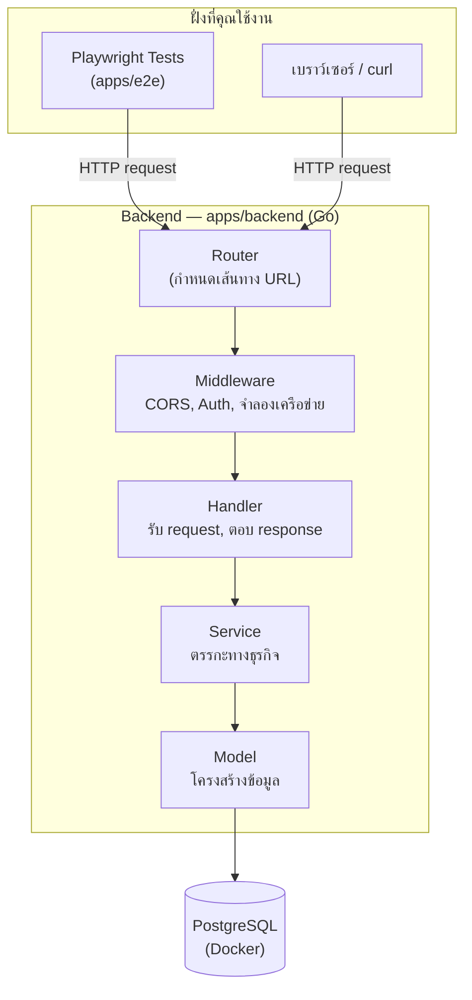
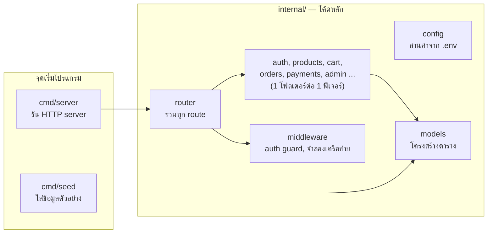
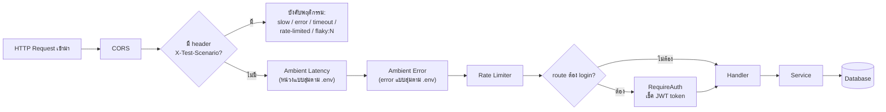
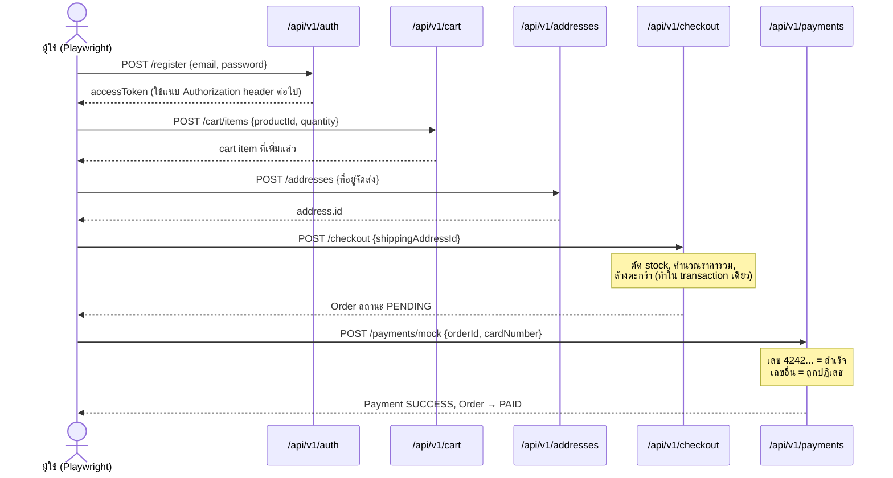
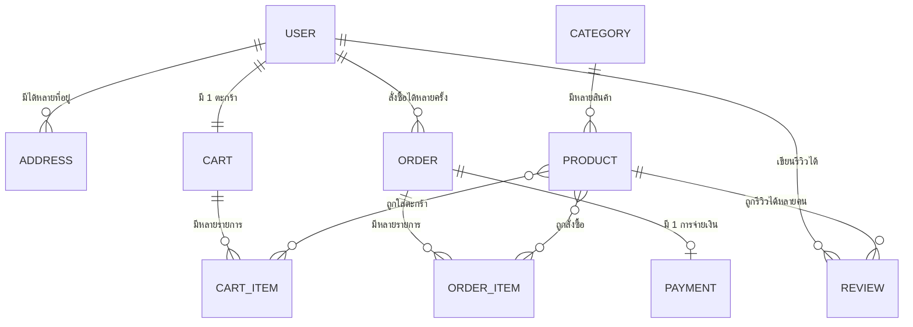

# PW_Learn — โปรเจคเรียนรู้ Playwright ระดับ Production

โปรเจคนี้จำลองระบบ e-commerce ขึ้นมาเพื่อใช้ **ฝึก Playwright ในระดับ production**
Backend (Go) คือ "ระบบเป้าหมาย" ที่สร้างให้สมจริง ส่วน Playwright (TypeScript) คือ
ตัวที่เราจะใช้เขียนเทสยิงเข้าไปทดสอบ

**สถานะปัจจุบัน:**
- ✅ Backend (Go + Gin + GORM + PostgreSQL) — ใช้งานได้ครบ
- ✅ ตัวอย่าง Playwright tests (ยิง API ตรงๆ เพราะยังไม่มี Frontend)
- ⏳ Frontend (Next.js) — ยังไม่ได้สร้าง

---

## 1. ภาพรวมระบบ (Architecture)



**อ่านง่ายๆ:** คุณ (หรือ Playwright) ยิง HTTP request เข้ามาที่ Router → ผ่าน
Middleware (เช็คสิทธิ์, จำลองความหน่วง/error) → Handler รับค่าแล้วเรียก Service →
Service คุยกับฐานข้อมูลผ่าน Model แล้วส่งผลลัพธ์กลับเป็นทอดๆ

## 2. โครงสร้างโฟลเดอร์

```
PW_Learn/
├── apps/
│   ├── backend/          ← โค้ด Go ทั้งหมด (ดูหัวข้อ 3)
│   └── e2e/               ← Playwright tests (TypeScript)
├── docker-compose.yml     ← สั่งรัน PostgreSQL
├── docker/                ← script สร้าง database ทดสอบ
└── docs/superpowers/      ← เอกสารดีไซน์/แผนงานฉบับเต็ม (ละเอียดมาก)
```

## 3. ข้างในเดียว `apps/backend` มีอะไรบ้าง



แต่ละฟีเจอร์ (เช่น `internal/cart/`) จะมี 2 ไฟล์เสมอ:
- **`handler.go`** — รับ HTTP request, แปลง JSON, เรียก service, ตอบกลับ
- **`service.go`** — ตรรกะจริง (เช่น เช็ค stock, คำนวณราคา) ไม่ยุ่งกับ HTTP เลย

แยกแบบนี้เพื่อให้ทดสอบ service ได้โดยไม่ต้องยิง HTTP จริง และอ่านง่ายว่าอะไรคือ
"กติกาธุรกิจ" กับอะไรคือ "ท่อส่งข้อมูล"

## 4. Flow การทำงานของ 1 request (พร้อม middleware จำลองเครือข่าย)



**นี่คือจุดเด่นของ backend นี้:** ปกติ backend จริงจะสุ่มช้า/error แบบควบคุมไม่ได้
ทำให้เทสไม่เสถียร (flaky test) แต่ backend นี้ให้คุณ**สั่งพฤติกรรมที่แน่นอน**ผ่าน
header `X-Test-Scenario` ได้ เช่น สั่งให้ fail 2 ครั้งแรกแล้วครั้งที่ 3 สำเร็จ
(`flaky:2`) เพื่อเขียนเทสพิสูจน์ retry logic แบบ reproducible 100%

## 5. Sequence Diagram — เดิน flow ซื้อของทั้งหมด

นี่คือสิ่งที่ไฟล์ `apps/e2e/tests/checkout-journey.spec.ts` ทดสอบ:



## 6. ER Diagram — ความสัมพันธ์ของข้อมูล



จุดที่น่าสังเกต: **`OrderItem.priceAtPurchase`** เก็บราคา ณ ตอนสั่งซื้อแยกจาก
`Product.price` — เพราะถ้าร้านค้าขึ้นราคาสินค้าทีหลัง ออเดอร์เก่าต้องยังแสดงราคาเดิม
ที่ลูกค้าจ่ายจริง ไม่ใช่ราคาปัจจุบัน

## 7. วิธีรันทั้งระบบ

```bash
# 1) เปิด PostgreSQL
docker compose up -d

# 2) รัน backend
cd apps/backend
go run ./cmd/seed      # ใส่ข้อมูลตัวอย่าง (สินค้า 20 ชิ้น, บัญชีทดสอบ)
go run ./cmd/server    # เปิดที่ http://localhost:4000

# 3) รัน Playwright tests (เปิด terminal ใหม่)
cd apps/e2e
npm install
npx playwright test
npx playwright show-report   # ดูผลแบบ HTML
```

## 8. บัญชีทดสอบที่ seed ไว้ให้

| Email | Password | สิทธิ์ |
|---|---|---|
| `admin@example.com` | `Admin123!` | ADMIN |
| `customer@example.com` | `Customer123!` | CUSTOMER |

## 9. Endpoint ทั้งหมด (`/api/v1`)

| กลุ่ม | หน้าที่ |
|---|---|
| `auth` | register, login, refresh, logout, forgot/reset password |
| `products`, `categories` | ค้นหา/กรอง/เรียง/แบ่งหน้าสินค้า |
| `reviews` | ดู + เขียนรีวิว (เขียนต้อง login) |
| `cart` | ดู/เพิ่ม/แก้/ลบ ของในตะกร้า (ต้อง login) |
| `addresses` | ดู/สร้างที่อยู่จัดส่ง (ต้อง login) |
| `checkout` | สร้างออเดอร์จากตะกร้า (ต้อง login) |
| `orders` | ดูออเดอร์ของตัวเอง (ต้อง login) |
| `payments/mock` | จ่ายเงินจำลอง |
| `admin/*` | จัดการสินค้า/ออเดอร์ (ต้องเป็น admin) |
| `/test/reset` | ล้าง+ใส่ข้อมูลใหม่ (ใช้เฉพาะตอนเทส) |

## 10. รันชุดเทสของ backend เอง (Go)

```bash
cd apps/backend
go test ./...
```

## 11. เอกสารฉบับเต็ม

แผนงานและดีไซน์แบบละเอียดมาก (รวมส่วน Frontend/Playwright ที่ยังไม่ได้สร้าง) อยู่ที่
`docs/superpowers/specs/` และ `docs/superpowers/plans/`
